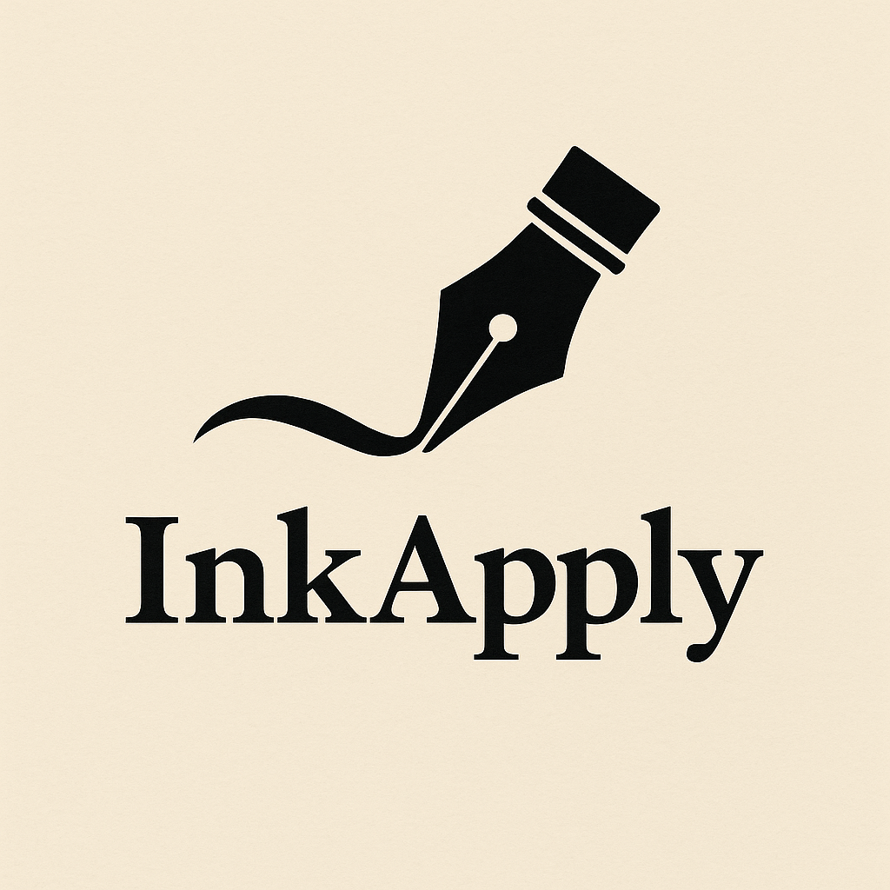

# InkApply

# ✍️ InkApply – AI Resume & Cover Letter Generator (Powered by Generative AI)

  

**InkApply** is a smart, AI-powered web application that generates personalized, ATS-friendly resumes and cover letters in seconds. Built with **Streamlit** and **Hugging Face Transformers**, this project harnesses the power of Large Language Models (LLMs) to help job seekers craft tailored application documents that stand out.

---

## 🚀 Features

- **Cover Letter Generator** – Generate customized cover letters based on your resume and job title.
- **Resume Enhancer** – Improve bullet points, summaries, and skills sections to match specific job roles.
- **Job Description Analyzer** – Extracts key skills and aligns content with job requirements.
- **Streamlit Interface** – Simple and clean UI for an easy, guided writing experience.
- **Real-Time Generation** – Get instant, editable results using open-source LLMs.

---

## 🧠 Built With

- **Python 3.9+**
- **Streamlit** – Web interface
- **Hugging Face Transformers** – For LLM-based content generation
- **Pretrained LLMs** – Such as GPT2 or DistilGPT2 (no API key needed)
- **spaCy / NLTK** – For light NLP and keyword extraction (optional)

---
## 📸 Live Demo

[🔗 Try the App on Hugging Face Spaces](comingsoon.....)
