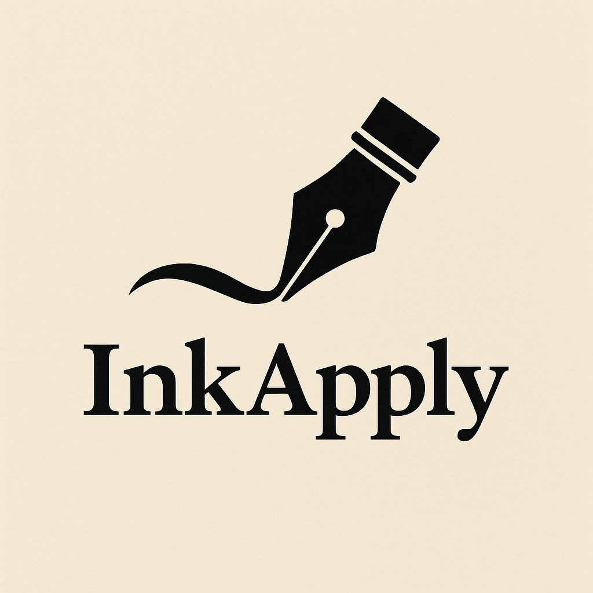

# InkApply

# ✍️ InkApply — AI Resume & Cover Letter System for ATS Optimization

<p align="center">
  
</p>

<p align="center">
  <b>An AI-powered system that transforms job descriptions and raw experience into structured, ATS-optimized resumes and tailored cover letters.</b>
</p>

---

## 🚀 Problem Statement

Most job seekers struggle with:

- Writing resumes that match ATS filtering systems  
- Translating experience into role-specific impact statements  
- Adapting applications for each job posting efficiently  
- Identifying what recruiters actually prioritize in job descriptions  

Generic AI tools generate text — but do not optimize for hiring systems.

---

## 💡 Solution

**InkApply** is built as a focused resume intelligence system, not a general-purpose chatbot.

It converts:
> Raw experience + Job description → Structured, ATS-aligned application documents

The system ensures every output is:
- Context-aware (job-specific)
- Keyword-aligned (ATS optimized)
- Structurally formatted (recruiter-ready)
- Professionally rewritten (impact-focused)

---

## ⚙️ Key Capabilities

### 🧠 Role-Aware Resume Transformation  
Automatically rewrites generic experience into job-targeted impact statements aligned with role expectations.

### 📄 ATS-Optimized Cover Letter Generator  
Generates structured, professional cover letters aligned with job requirements and recruiter signals.

### 🔍 Job Description Intelligence Layer  
Extracts:
- Required skills  
- Hidden keyword patterns  
- Responsibility clusters  
- Priority signals used in hiring decisions  

### ✍️ Structured Content Engine  
Ensures output follows professional resume architecture:
- Clear sections  
- Bullet optimization  
- Impact-driven phrasing  

### 💻 Interactive Streamlit Interface  
Simple, fast, and user-friendly interface designed for real-time editing and generation.

---

## 🧠 System Architecture

```text
User Input (Resume + Job Description)
        ↓
Text Processing Layer (spaCy / NLP cleanup)
        ↓
Skill & Keyword Extraction Module
        ↓
Prompt Construction Engine (Role-specific templates)
        ↓
Hugging Face Transformer Model Inference
        ↓
Post-Processing Layer:
    - Formatting normalization
    - ATS keyword reinforcement
    - Bullet restructuring
        ↓
Streamlit UI Rendering (Editable Output)
